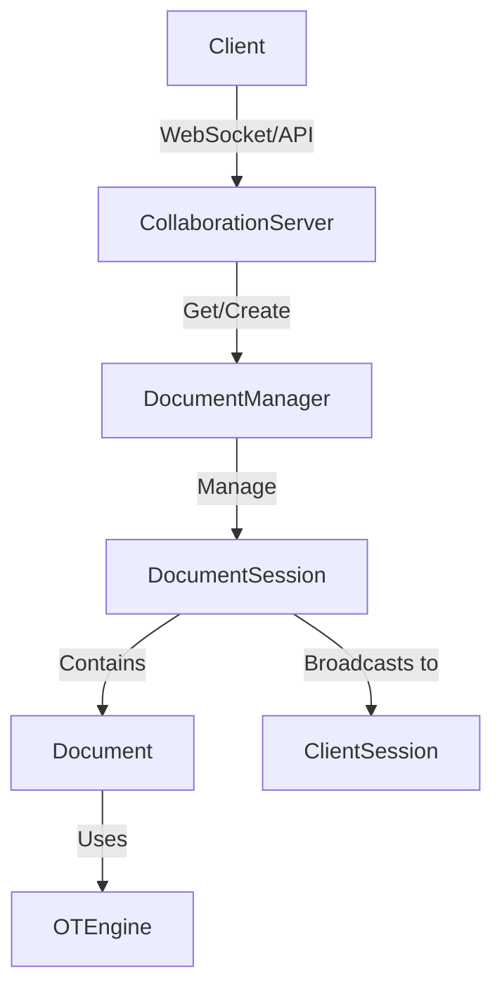

# Google Docs Low-Level Design (LLD) Analysis

This document analyzes the current repository implementation for a collaborative editor (Google Docs style) and verifies the correctness of the defined methods.

## 1. Overview of Current Implementation

The repository implements a basic **Operational Transformation (OT)** system in Java. It follows a Centralized Server architecture where the server acts as the single source of truth and responsible for transforming operations.

### Key Components:

- **`model.Document`**: Represents the document state. It uses a `StringBuilder` for content storage and an `OTEngine` to handle concurrency.
- **`model.ClientSession`**: Represents a connected user. It generates operations (`createInsert`, `createDelete`) and receives updates.
- **`service.CollaborationServer`**: The central coordinator. It delegates operation handling to the appropriate `DocumentSession`.
- **`service.OTEngine`**: The core logic for Operational Transformation. It maintains a history of operations and transforms incoming operations against the history to ensure convergence.
- **`operation.EditOperation`**: Abstract base class for mutations (`InsertOperation`, `DeleteOperation`).

## 2. Multi-Document Architecture (Scaled)

We have evolved the design to support **Multiple Documents** simultaneously. This moves away from a single-singleton server model to a scalable session-based architecture.

### 🧱 Architecture Overview

### 🧠 Core Components

#### 1. `DocumentSession` (Per-Document Isolation)
Each document is now an independent entity. Operations on "Doc-A" do not block or interfere with "Doc-B".
- **Responsibility**: 
  - Holds the unique `Document` state.
  - Manages the list of connected `ClientSession`s for *that specific document*.
  - Synchronizes access (locking) only for that document.
- **Benefits**:
  - **Granular Locking**: User A editing Doc 1 doesn't block User B editing Doc 2.
  - **Scalability**: Can be easily sharded in the future (though currently in-memory).

#### 2. `DocumentManager`
- **Responsibility**: 
  - A thread-safe registry (`ConcurrentHashMap`) of active document sessions.
  - Handles the lifecycle (creation/retrieval) of documents.

#### 3. `CollaborationServer` (Refactored)
- **Role**: Thin routing layer.
- **Logic**: 
  - Receives request: `(docId, userId, operation)`
  - Looks up `DocumentSession` via `DocumentManager`.
  - Forwards request to the session.

## 3. Verification of Methods

### 3.1. `OTEngine.transform(EditOperation incoming)`

- **Definition**: Iterates through the history of executed operations and transforms the `incoming` operation against any operation that has a revision number greater than or equal to the `incoming` operation's basis revision.
- **Correctness**: **Partially Correct**.
  - The logic `if (old.revision >= incoming.revision)` correctly identifies concurrent operations that have already been executed but were unknown to the incoming operation at the time of creation.
  - **Limitation**: It assumes a linear transformation path is sufficient. In complex OT systems (like Jupiter or COT), the order of transformation and the properties of the transformation function (TP1, TP2) are critical. For this simple server-centric model, it works provided the transformation functions are correct.

### 3.2. `InsertOperation.transformAgainst(EditOperation other)`

- **Definition**: Adjusts the insertion position based on a previous operation.
- **Logic**:
  - If `other` is `Insert` before `this`: Shift `this.position` right.
  - If `other` is `Delete` before `this`: Shift `this.position` left.
- **Correctness**: **Mostly Correct**.
  - It handles the basic index shifting.
  - **Edge Case**: Tie-breaking when `this.pos == other.pos` (both inserting at the same spot). The current logic `other.position <= this.position` means the _earlier_ operation (history) pushes the _later_ operation (incoming) to the right. This effectively gives priority to the server's history (or earlier arrived op).

### 3.3. `DeleteOperation.transformAgainst(EditOperation other)`

- **Definition**: Adjusts the delete position based on a previous operation.
- **Status**: **FIXED** (Previously Incorrect).
- **Original Issue**: The implementation _only_ adjusted `position`. It did **not** adjust `length` or handle overlapping deletions. This caused data corruption where concurrent deletions could delete the wrong characters.
- **Fix Applied**: The `transformAgainst` method now:
  1.  Calculates the intersection/overlap between the two delete operations.
  2.  Reduces `this.length` by the overlap amount (preventing double deletion or deleting wrong chars).
  3.  Adjusts `this.position` based on how many characters _strictly before_ `this.position` were deleted.
  4.  Handles "swallowing" of concurrent inserts inside the delete range (by extending the delete length).

## 4. Architecture Gaps for a "Google Docs" LLD

To upgrade this to a real Google Docs LLD, the following changes are needed:

1.  **Data Structure**:

    - **Current**: `StringBuilder` (O(N) insert/delete).
    - **Required**: **Piece Table**, **Rope**, or **Gap Buffer** for efficient editing of large documents.

2.  **Communication Protocol**:

    - **Current**: Sends full document text on every update (`sendUpdate`).
    - **Required**: Send only **Deltas/Operations**. Clients should apply operations to their local state.

3.  **Client-Side OT**:

    - **Current**: Clients are dumb terminals.
    - **Required**: Clients need their own `OTEngine` and State Machine (Synchronized, Awaiting Confirm, Awaiting With Buffer) to handle local optimistic updates and server acknowledgments.

4.  **Delete Transformation Logic**:
    - Must be updated to handle:
      - Range reduction (if part of the range was already deleted).
      - Range splitting (if an insert happened in the middle of a delete range).
      - Identity preservation.

## 5. Summary

The repository provides a **proof-of-concept** for OT. It correctly identifies the need for transformation and history. The critical bug in `DeleteOperation` regarding overlapping deletions has been **FIXED**. 

**New**: The system now supports **Multi-Document Collaboration** with isolated sessions, proving that the OT logic can scale horizontally across independent documents.
